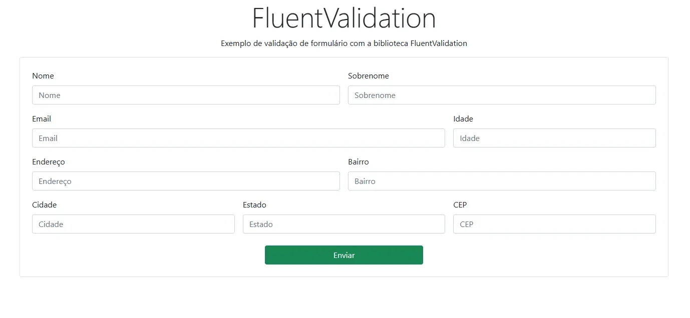
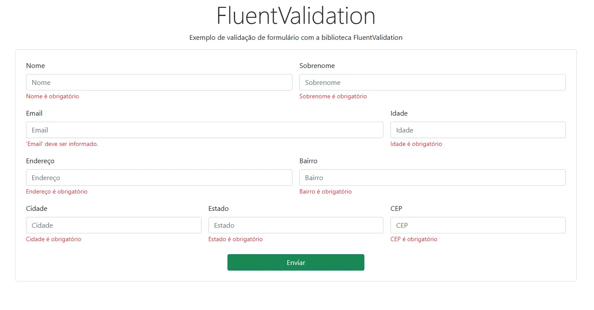
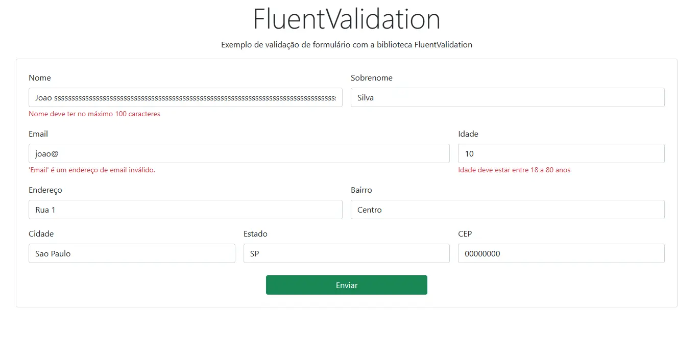

# FluentValidation Sample
Aplicativo feito em ASP.NET CORE MVC para realizar validações com FluentValidation.

## Sobre o Projeto
Este projeto é um aplicativo ASP NET CORE MVC que realiza validações de um formulário utilizando a biblioteca FluetValidation.

## Layout
Exemplo 1:

<p align="left">
  
</p>

Exemplo 2: 

<p align="left">
  
</p>

Exemplo 3:

<p align="left">
  
</p>

## Como rodar o projeto 
### Clone este repositório
```
git clone https://github.com/leandrorossi/redis-postgres-api.git
```

### Executando via dotnet CLI
Você pode rodar o projeto via dotnet CLI com o seguinte comando:
```
dotnet run
```

### Executando via DockerFile
O projeto possui um arquivo dockerfile caso queira rodar via docker:
```
docker image build -t fluentvalidation-sample -f .\FluentValidation-Sample\Dockerfile .

docker container run --name FluentValidantion-Sample -d -p 8080:8080 fluentvalidation-sample
```

## Tecnologias utilizadas
As seguintes ferramentas foram usadas na construção do projeto:
- ASP.NET CORE
- FluentValidation
- Docker

## Autor
 
 <br />
 <span><b>Feito por Leandro Rossi</b></span>
 <br />
 <br />

 [](https://www.linkedin.com/in/leandro-rossi-4769ab1a6/)
 [](mailto:le_andro18@hotmail.com)
